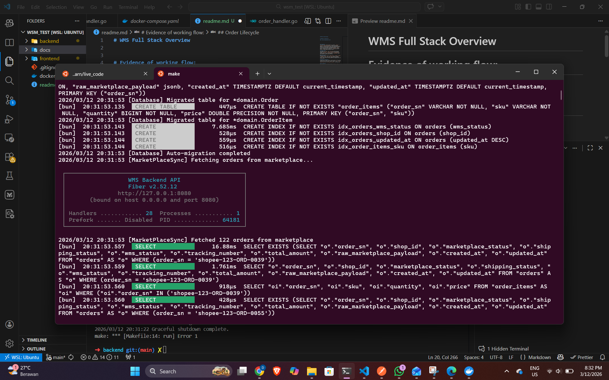
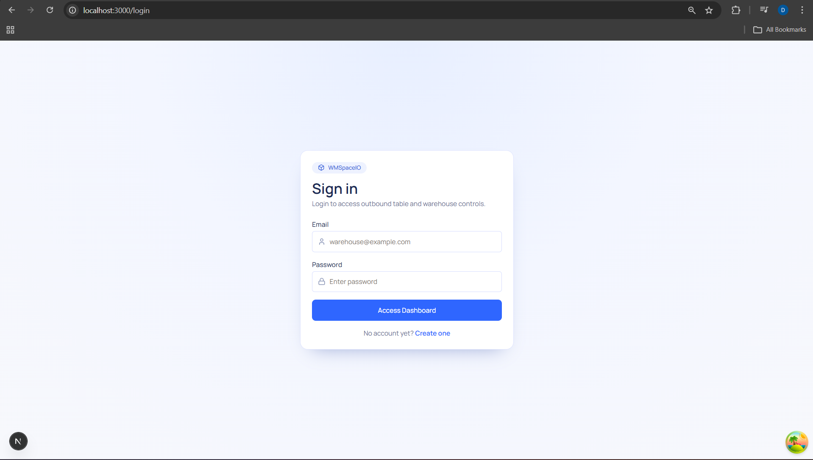
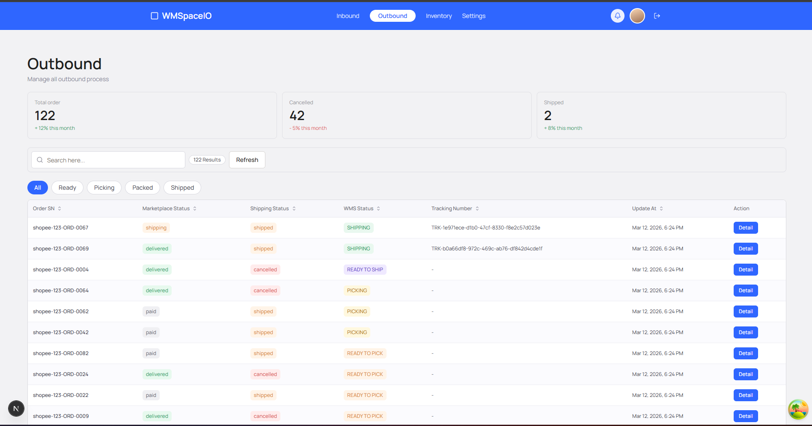
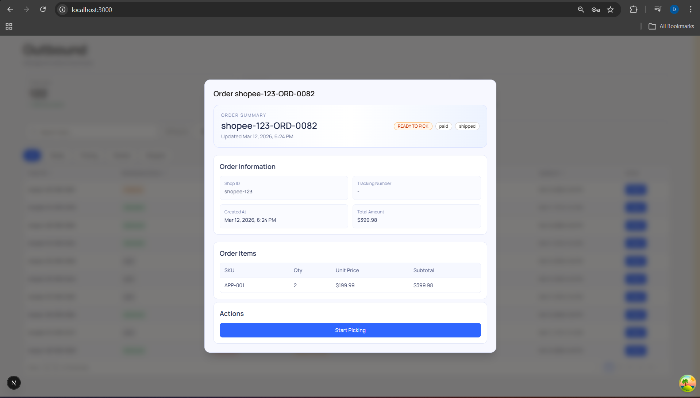

# WMS Full Stack Overview

# Evidence of working flow:

1. when the application start, the data from the market place get sync. 

2. on the first load page, user will ask either to login or register. 

3. then the warehouse dashboard will listing all order.

4. on the detail of there will be an action to process the order

<video src="./docs/images/video-001.mp4" controls="controls" style="max-width: 100%;">
  Your browser does not support the video tag.
</video>

## Architecture
The system uses a layered backend in Go (Fiber): `handler -> service -> repository/integration`. Handlers expose REST endpoints, services enforce business rules, repositories persist WMS data with Bun/PostgreSQL, and the marketplace integration client calls external APIs. JWT middleware protects `/api/*` business routes, while auth endpoints (`/api/auth/*`) remain public. A background sync worker runs at startup and every 5 minutes to import/update marketplace orders.

## Database Design
Core tables are `orders` and `order_items` with one-to-many relation by `order_sn`. `orders` stores WMS and marketplace states (`wms_status`, `marketplace_status`, `shipping_status`), tracking number, totals, and timestamps. `order_items` stores SKU, quantity, and price per order line.

## Order Lifecycle
WMS state machine is strict: `READY_TO_PICK -> PICKING -> PACKED -> SHIPPED`. `pick`, `pack`, and `ship` endpoints validate current state before transition. Shipping calls marketplace logistic API, then saves tracking number and shipping status back to local order.

## Marketplace Integration
Integration uses OAuth authorize + token exchange, stores access/refresh tokens in memory, and refreshes token on `401`. Supported operations include list/detail orders, logistic channels (`/api/logistic/chanel` and `/api/logistic/channels`), and ship order.

## Error Handling
API responses use a consistent envelope (`message`, `data`, `error`). Domain errors map to HTTP status codes in handlers. Middleware provides panic recovery and structured logging. Marketplace client retries transient failures (429/5xx with backoff) and returns detailed API errors for diagnostics.